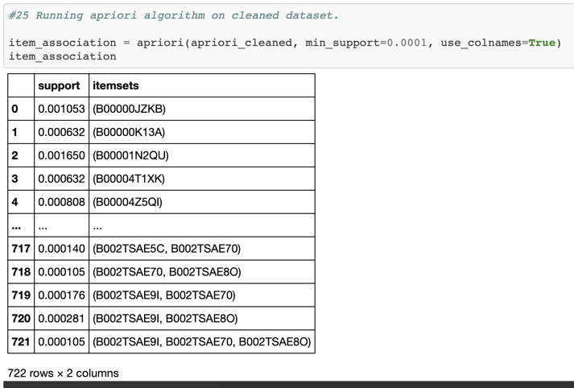
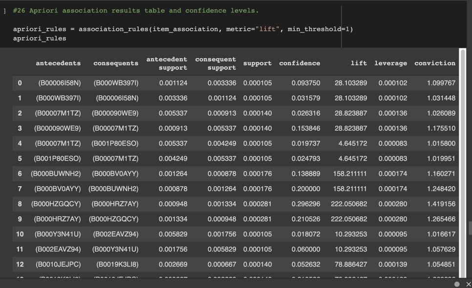
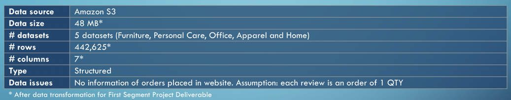
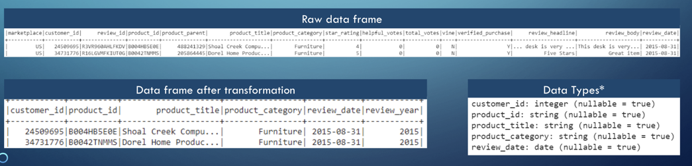

# final_project

[Link to project tracker](https://docs.google.com/spreadsheets/d/1WJBlla5ap6cchO12OfbjRwCKj17eBbcxXQNUqc3g52o/edit#gid=2063972108)

[Link to presentation](https://docs.google.com/presentation/d/1BNm6gF_iD4guTDOlRPsiFmyAij_SqHRqjMEp_T4HXd8/edit)

## Presentation (30 points)

[Link to presentation](https://docs.google.com/presentation/d/1BNm6gF_iD4guTDOlRPsiFmyAij_SqHRqjMEp_T4HXd8/edit#slide=id.gd0128d9d41_0_4)

Content

The presentation outlines the project, including the following:

Selected topic: ✅
- Ecommerce Consumer Beahvior: An Investigation of Amazon’s Consumer Behavior

- Reason they selected the topic ✅:
  - Data analysis is key for strategic and well-informed decision making
  - Big data allows e-commerce businesses to understand customers better through customer behavior analysis
  - Helps target specific customers segments to upsell products, increase conversion rates and grows sales
  - Better customer segmentation to improve targeted marketing campaigns and increase sales
  - Product reviews are a great source of customer feedback and is one of the main drivers for conversion rates, developing an automated way to process them can help drive product enhancements and accelerate decision making

- Description of the source of data: ✅
  - Team will be using Amazon S3 data.

- Questions they hope to answer with the data: ✅
  - Question #1: Can we predict which products a customer will most likely purchase together within various product segments?
  - Question #2: Can we identify customer segments based on the purchased product categories to better target marketing campaigns?
  - Question #3: Can we extract key topics within product reviews to help companies analyze and interpret customer feedback?

- Description of the data exploration phase of the project: ✅
  - Each research question contains its own respective ETL process. Full details of the process are available on the presentation slides link: 
  - [Link to presentation](https://docs.google.com/presentation/d/1BNm6gF_iD4guTDOlRPsiFmyAij_SqHRqjMEp_T4HXd8/edit)
  - Below is the ETL Process:
   - Extract: Team extracted product or product segments from Amazon S3.
   - Transform: Team loaded the data into a PySpark dataframe and performed preliminary cleaning in preparation to create a dataframe suitable for analysis.
   - Load: The team downloaded Postgres driver that allows for Spark to interact with PostgresSQL, configured PostgresSQL settings, and wrote the cleaned tables into PostgresSQL.

- Description of the analysis phase of the project: ✅
  - Please see ML Model document for further explanation:
  - Question #1: Can we predict which products a customer will most likely purchase together within various product segments? 
   - Apriori Algorithm Association Analysis 
  - Question #2: Can we identify customer segments based on the purchased product categories to better target marketing campaigns? 
   - Unsupervised Learning K-Means Cluster Analysis
  - Question #3: Can we extract key topics within product reviews to help companies analyze and interpret customer feedback?
   - Natural Language Processing Topic Analysis
 
Draft of Presentation Slides: ✅
- [Link to presentation](https://docs.google.com/presentation/d/1BNm6gF_iD4guTDOlRPsiFmyAij_SqHRqjMEp_T4HXd8/edit#slide=id.gd0128d9d41_0_4)

## GitHub Repository (10 points)

### Main Branch

The main branch should include:

- README.md :white_check_mark:

### README.md

The README.md should include:

- Description of the communication protocols :white_check_mark:
  - Team members communicate primarily via slack
  - Questions and comments are also relayed by leveraging the Google Apps' comments tool
  - Deliverables and issues are tracked in the team's google sheeet to ensure all team members are aligned on the status of all the project's component parts
  - All project files are available to team members via this Github repo

### Individual Branches

Requirements for the individual branches follow:

- At least one branch for each team member :white_check_mark:

- Each team member has at least four commits for the duration of the first segment :white_check_mark:

List of all branches:

- main
- james-branch
- alexa-branch
- livia-branch
- anthony-branch
- markdowns
- resources-branch
- database
- ml-model

Note: indvidual branches will soon be deleted in favor of role/deliverable aligned branches.

## Machine Learning Model (35 points)

[Link to machine learning schema](https://docs.google.com/document/d/1KiMA-ZG77uDJ1l1j62DKldMrqqjs5tJmXGeLCcyKyWo/edit)

Team members will be expected to present a provisional machine learning model that stands in for the final machine learning model and accomplishes the following:

- Takes in data from the provisional database :white_check_mark:

- Outputs label for input data :white_check_mark:

## Database Integration (25 points)

Team members will be expected to present a provisional database that stands in for the final database and accomplishes the following:

- Sample data that mimics the expected final database structure or schema :white_check_mark:

- Draft machine learning model is connected to the provisional database :white_check_mark:

## Dashboard (0 points)

There are no deliverables associated with the dashboard for this segment.
