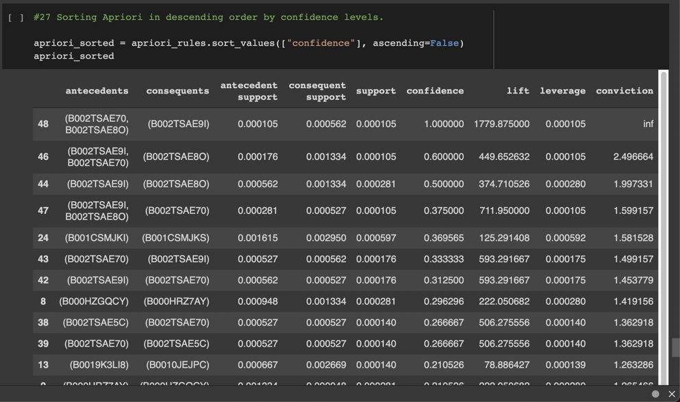

# final_project

[Link to project tracker](https://docs.google.com/spreadsheets/d/1WJBlla5ap6cchO12OfbjRwCKj17eBbcxXQNUqc3g52o/edit#gid=2063972108)

[Link to df csv file week 1](https://drive.google.com/drive/folders/18hYQ8VMuRqI5BbjhQWmEmcKjGr8gxxyc?usp=sharing)

## Presentation (30 points)

Content

[Link to presentation](https://docs.google.com/presentation/d/1BNm6gF_iD4guTDOlRPsiFmyAij_SqHRqjMEp_T4HXd8/edit#slide=id.gd0128d9d41_0_4)

The team members have drafted their project, including the following:

- Selected topic :white_check_mark:
  - Help Amazon identify products bought together to increase upsell and revenues by analyzing Amazon Marketplace data for relationships between Customer IDs and Product IDs.

- Reason they selected the topic :white_check_mark:
  - Data analysis is key for strategic and well-informed decision making
  - Big data allows e-commerce businesses to understand customers better through customer behavior analysis
  - Helps target specific customers segments to upsell products, increase conversion rates and grow sales

- Description of the source of data :white_check_mark:
  - Amazon.com reviews data publically available from Amazon S3.

- Questions they hope to answer with the data :white_check_mark:
  - Can we predict which products a consumer will most likely purchase together across product categories?

- Note:
  - The content does not yet need to be in the form of a presentation. It can be text in the README.md.

## GitHub Repository (10 points)

### Main Branch

The main branch should include:

- README.md :white_check_mark:

### README.md

The README.md should include:

- Description of the communication protocols :white_check_mark:
  - Team members communicate primarily via slack
  - Questions and comments are also relayed by leveraging the Google Apps' comments tool
  - Deliverables and issues are tracked in the team's google sheeet to ensure all team members are aligned on the status of all the project's component parts
  - All project files are available to team members via this Github repo

### Individual Branches

Requirements for the individual branches follow:

- At least one branch for each team member :white_check_mark:

- Each team member has at least four commits for the duration of the first segment :white_check_mark:

List of all branches:

- main
- james-branch
- alexa-branch
- livia-branch
- anthony-branch
- markdowns
- resources-branch
- database
- ml-model

Note: indvidual branches will soon be deleted in favor of role/deliverable aligned branches.

## Machine Learning Model (35 points)

[Link to machine learning schema](https://docs.google.com/document/d/1KiMA-ZG77uDJ1l1j62DKldMrqqjs5tJmXGeLCcyKyWo/edit)

Team members will be expected to present a provisional machine learning model that stands in for the final machine learning model and accomplishes the following:

- Takes in data from the provisional database :white_check_mark:

- Outputs label for input data :white_check_mark:

## Database Integration (25 points)

Team members will be expected to present a provisional database that stands in for the final database and accomplishes the following:

- Sample data that mimics the expected final database structure or schema :white_check_mark:

- Draft machine learning model is connected to the provisional database :white_check_mark:

## Dashboard (0 points)

There are no deliverables associated with the dashboard for this segment.
